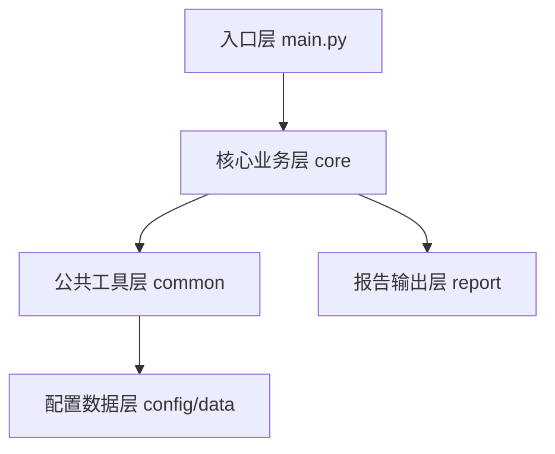

# AI大模型自动化评测系统
> 最后更新时间：2026年7月 | 版本：v0.1.0


基于 Python 开发的轻量级大模型自动化评测工具，面向AI测试开发场景，采用YAML数据驱动设计，支持批量Prompt评测、响应有效性校验、内容合规检测、规则版幻觉检测与多维度量化打分，自动生成评测报告，可用于大模型版本效果回归、基线对比、内容质量专项测试场景。

## ✨ 核心亮点
- 🧪 **分层评测体系**：有效性校验 → 合规性检测 → 智能打分 → 幻觉识别，全链路自动化
- 🎯 **多维量化打分**：相关性、完整度、合规性加权计算，评分规则可配置
- 🔍 **幻觉检测能力**：基于标准答案反向比对，自动识别疑似编造内容，标记风险等级
- 📊 **数据驱动设计**：评测用例全量YAML管理，新增场景无需修改Python代码
- 🛡️ **高容错执行**：单用例异常隔离，网络波动自动重试，批量任务不中断
- 📝 **企业级规范**：密钥脱敏、日志埋点、环境变量管理，符合安全开发标准
- ♻️ **成熟基底复用**：核心组件复用双项目验证的成熟代码，稳定性有保障

## 🏗️ 架构设计


## 📦 环境依赖

 
- Python 3.8+
- 可用的大模型API密钥（兼容OpenAI协议标准）
- 完整依赖清单见 requirements.txt
 
## 🚀 快速上手
 
### 1. 安装依赖

```bash
pip install -r requirements.txt
```
 
### 2. 配置密钥
项目根目录创建  `.env`  文件（复制  `.env.example`  模板修改即可）：
 
```ini
AI_API_KEY=sk-你的大模型密钥
LLM_MODEL=deepseek-v4-flash
```
 
### 3. 运行评测

```bash  
python main.py
```
 
### 4. 查看结果

- 控制台输出：实时执行日志 + 评测指标汇总报告
- CSV报告： ./output/eval_report.csv （Excel直接打开）
- 全链路日志： ./logs/  目录按日期拆分
 
## 📁 项目目录结构
 
```text

├── common/             # 公共工具层：全项目复用基础组件
│   ├── logger.py       # 标准化日志工具，控制台+文件双输出
│   └── yaml_reader.py  # YAML配置读取工具，支持缓存、点式路径、环境变量占位
├── config/             # 配置文件层：所有可变参数外置
│   ├── config.yaml     # 全局框架配置
│   └── eval_rules.yaml # 评测规则配置（敏感词、权重、校验阈值）
├── core/               # 核心业务层：评测核心逻辑
│   ├── llm_client.py   # 大模型请求客户端，统一封装接口调用
│   ├── batch_runner.py # 批量评测执行器，负责任务调度与结果收集
│   ├── validator.py    # 响应校验模块：有效性+合规性双校验
│   └── scorer.py       # 智能评分模块：多维打分 + 幻觉检测
├── data/               # 评测数据层：YAML格式存储评测用例
│   └── eval_cases.yaml # 评测用例集
├── report/             # 报告输出层
│   └── reporter.py     # CSV评测报告导出工具
├── logs/               # 运行日志输出目录（自动生成）
├── output/             # 评测报告输出目录（自动生成）
├── main.py             # 项目唯一入口
├── requirements.txt    # 项目依赖清单
└── README.md           # 项目说明文档
```

## 📖 更多文档
 
- 详细使用与原理说明：见[DETAILED_USAGE.md](DETAILED_USAGE.md)，包含完整调用链路、代码详解、选型考量
- 版本变更记录：见 [CHANGELOG.md](CHANGELOG.md)
 
## 📄 License

本项目采用 MIT 协议开源，详见 [LICENSE](LICENSE) 文件。